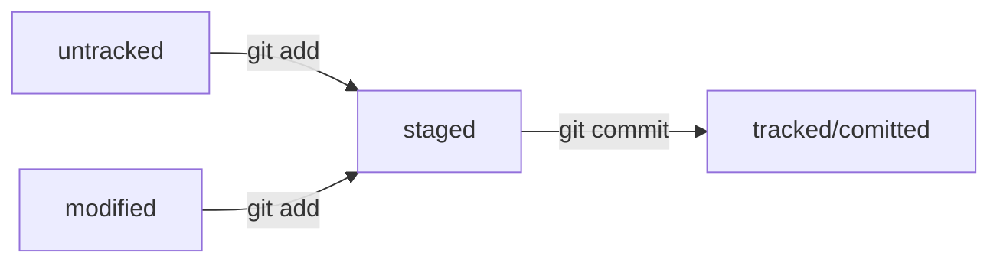

Конспект курса Яндекс.Практикум "Основы работы с Git"

HEAD -- это голова.
Коммит -- это всему голова.
Статусы файлов: 

```mermaid
graph LR;
untracked -- "git add" --> staged;
staged -- "git commit" --> tracked/comitted;
modified -- "git add" --> staged;
```
